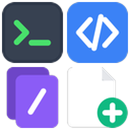

<div align="center">



# Righto

**Windows처럼 쓰는 macOS Finder 우클릭 메뉴**

터미널 열기 · 에디터로 열기 · 경로 복사 · 새 파일 · 잘라내기/붙여넣기 · 숨김 파일 전환


[](https://github.com/siyul-jh/righto/actions/workflows/dmg.yml)

</div>

---

## 기능

| | 기능 | 설명 |
|---|---|---|
|  | **여기서 터미널 열기** | 선택한 폴더(파일이면 그 위치)를 설정한 터미널로 연다. 메뉴에 앱 이름과 아이콘이 표시된다 |
|  | **에디터로 열기** | 선택한 파일·폴더를 설정한 에디터로 연다. 메뉴에 앱 이름과 아이콘이 표시된다 |
|  | **경로 복사** | 전체 경로 / 이름만 / 셸 이스케이프 경로 / 상대 경로 |
|  | **새 파일** | `.txt` `.md` `.json` `.html` `.py` `.sh` (json·html·sh는 기본 내용 포함) |
|  | **잘라내기** | 선택 항목을 잘라낸다 |
|  | **여기에 붙여넣기 (이동)** | 잘라낸 항목이 있을 때만 나타난다. 이름이 겹치면 번호를 붙인다 |
|  | **숨김 파일 표시 전환** | `Cmd+Shift+.` 와 같은 효과를 메뉴에서 실행한다 |

폴더 배경, 폴더, 파일 우클릭과 Finder 도구 막대 버튼에서 같은 메뉴를 쓸 수 있다.

## 설치

### 방법 1. DMG (권장)

[Releases](https://github.com/siyul-jh/righto/releases)에서 최신 `Righto-<버전>.dmg`를 받는다. 직접 만들려면 `./dmg.sh`(→ `dist/Righto-<버전>.dmg`)를 실행한다.

1. DMG를 열고 **Righto.app**을 **Applications**로 끌어다 놓는다.
2. `Righto.app`을 한 번 실행한다. 설정 창이 열리면 터미널·에디터를 고르고 **적용**을 누른다.
3. **시스템 설정 > 개인정보 보호 및 보안 > 확장 프로그램 > Finder**에서 `Righto`를 켠다.

> **다른 Mac에서 받은 DMG:** Apple 개발자 인증(공증)이 없는 ad-hoc 서명이라 "확인되지 않은 개발자" 경고가 뜬다. 소스를 확인한 뒤 격리 속성을 제거하고 실행한다.
> ```sh
> xattr -dr com.apple.quarantine /Applications/Righto.app
> ```
>
> **소스 빌드 버전이 이미 있다면:** `~/Applications/Righto.app`을 지우고 설치해야 확장이 중복 등록되지 않는다.

### 방법 2. 소스 빌드

Xcode(`swiftc`)만 있으면 된다. 외부 의존성은 없다.

```sh
git clone https://github.com/siyul-jh/righto
cd righto
./build.sh
```

`build.sh`는 `~/Applications/Righto.app`을 ad-hoc 서명으로 빌드하고 Finder 확장을 등록한 뒤 Finder를 재시작한다.

메뉴가 나오지 않으면 **시스템 설정 > 개인정보 보호 및 보안 > 확장 프로그램 > Finder**에서 `Righto`를 켠다.

### 숨김 파일 전환 권한 (선택)

Finder를 재시작하지 않고 전환하려면 **시스템 설정 > 개인정보 보호 및 보안 > 손쉬운 사용**에 `~/Applications/Righto.app`을 추가해 켠다.
권한이 없으면 설정을 바꾸고 Finder를 재시작하는 방식으로 대신 동작한다(화면이 잠깐 깜박임).

## 릴리스 자동화

`main`에 push하면 GitHub Actions(`.github/workflows/dmg.yml`)가 DMG를 빌드한다.

- **항상:** 빌드한 DMG를 Actions 아티팩트로 올린다.
- **`VERSION`을 올린 push일 때만:** 같은 버전의 릴리스가 없으면 태그 `v<버전>`과 Release를 만들고 DMG를 첨부한다.

새 버전을 내려면 `VERSION` 파일을 올려서 push하면 된다.

## 설정

`Righto.app`을 실행하면 설정 창이 열린다. 터미널과 에디터를 고르고 **적용**을 누른다. 적용하기 전까지는 저장되지 않고, **닫기**를 누르면 변경이 버려진다.

| | 목록에 나오는 앱 |
|---|---|
| **터미널** | cmux, Ghostty, iTerm, Warp, Terminal 중 설치된 것 |
| **에디터** | Antigravity, Cursor, VS Code, Zed, Sublime Text, BBEdit, Nova, CotEditor, Xcode, TextEdit 중 설치된 것 |

- 목록에 없는 앱은 **기타…**로 직접 고른다.
- 한 번도 고르지 않았거나 고른 앱이 지워졌으면 설치된 목록의 첫 번째 앱을 쓴다.
- 설정은 `~/Library/Application Support/Righto/config.json`에 저장된다.
- kitty, Alacritty처럼 폴더를 명령줄 인자로만 받는 터미널은 폴더가 열리지 않을 수 있다.

## 구조

```
righto/
├── FinderMenu.swift     Finder Sync 확장 (샌드박스). 메뉴와 동작
├── Host.swift           Righto.app. 설정 창과 숨김 파일 전환(샌드박스 밖)
├── Config.swift         터미널·에디터 선택 설정 (설정 창과 확장이 공유)
├── ext.entitlements     확장 권한 (샌드박스 + /Users/, /Volumes/ 쓰기)
├── build.sh             빌드 · 서명 · 등록 스크립트
├── dmg.sh               DMG 생성 스크립트 (dist/Righto-<버전>.dmg)
├── VERSION              버전 (현재 0.0.1)
└── icons/               아이콘 원본(1024px)과 메뉴용(64px)
```

- **네트워크 코드 없음.** 통신하는 부분이 없고 외부 라이브러리도 쓰지 않는다.
- **최소 권한.** 확장은 샌드박스에서 실행되며 `/Users/`와 `/Volumes/`에만 쓸 수 있다.
- 샌드박스 확장은 Finder 설정을 바꿀 수 없어서, 숨김 파일 전환은 `righto://toggle-hidden` URL로 `Righto.app`에 요청한다. `build.sh`는 `--register`로 실행해 등록만 하고 바로 끝낸다.

## 한계

| 상황 | 내용 |
|---|---|
| **iCloud Drive** | macOS가 Finder Sync 확장을 막아 우클릭 메뉴가 뜨지 않는다. 도구 막대의 Righto 버튼을 사용한다 |
| **macOS 업데이트 후** | 메뉴가 사라지면 `./build.sh`를 다시 실행한다 |
| **재빌드 후** | ad-hoc 서명이라 손쉬운 사용 권한이 초기화될 수 있다 |
| **다른 Mac에서 사용** | 그 Mac에서 `./build.sh`를 다시 실행해야 한다 |

## 아이콘

아이콘은 AI로 생성했다. 프롬프트는 [`icon-prompts.md`](icon-prompts.md)(메뉴 7종)와 [`toolbar-icon-prompt.md`](toolbar-icon-prompt.md)(도구 막대)에 있다.

## 라이선스

[MIT](LICENSE)
